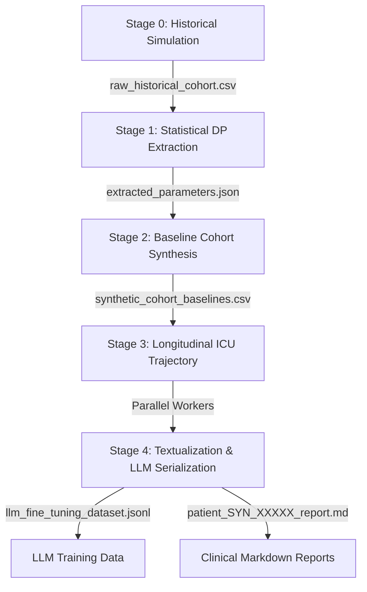

# AGENTS.md

This file provides project-specific context, mental models, commands, and constraints for AI coding agents collaborating on the EHR Synthesis Engine project.

---

## 🧠 Mental Model & Architecture

This project is a modular clinical simulation and synthesis pipeline designed to generate realistic, privacy-preserving ICU patient cohorts. Its primary objective is to simulate **Vancomycin-Zosyn Synergistic Nephrotoxicity** (drug-induced Acute Kidney Injury) to generate fine-tuning payloads for AI-based clinical sentinels.

The pipeline runs in 5 distinct stages:



1. **Stage 0: Messy Historical Data Simulation (`src/data_extraction.py` -> `generate_mock_historical_data`)**
   - Simulates baseline covariates (age, gender), baseline Serum Creatinine (SCr), drug exposure assignments, and AKI outcomes containing realistic confounding variables.
2. **Stage 1: Parameter Extraction with Differential Privacy (`src/data_extraction.py` -> `extract_statistical_parameters`)**
   - Extracts demographic marginals, log-space Serum Creatinine distributions, covariance adjustments, and exposure hazard rates.
   - If `--epsilon` is enabled, applies Laplace noise using mathematically derived L1 sensitivities and sequential privacy budget composition.
3. **Stage 2: Vectorized Baseline Cohort Synthesis (`src/generator.py` -> `synthesize_cohort`)**
   - samples baseline characteristics using only the extracted parameters. Fully vectorized via NumPy (O(N) assembly, no Python loops).
4. **Stage 3: Longitudinal ICU Trajectory Simulation (`src/generator.py` -> `generate_temporal_record` & `process_cohort_parallel`)**
   - Simulates 5-day trajectories in parallel. Computes cumulative drug exposure, hemodynamics (MAP), and renal decay (SCr rise based on KDIGO criteria).
5. **Stage 4: Textualization & LLM Serialization (`src/textualization.py`)**
   - Serializes data into prompt-response conversation JSONL formats for LLM fine-tuning and rich clinical Markdown files.

---

## 🛠️ Technology Stack

- **Core**: Python 3.8+
- **Data Manipulation**: `pandas`, `numpy` (heavy vectorization)
- **Scientific/Statistical Computations**: `scipy` (Wasserstein distance, Chi-Square, entropy)
- **Differential Privacy**: `diffprivlib` (and custom Laplace mechanism implementation)
- **Headless Visualization**: `matplotlib` (Agg backend)
- **CLI/Concurrency**: `argparse`, `concurrent.futures` (ProcessPoolExecutor)

---

## 🚀 Common Commands

### 1. Run the Pipeline
Run a standard execution generating 500 historical patients, 10 synthetic patients, and saving 5 clinical reports:
```bash
python main.py
```

Run with formal $( \epsilon, 0 )$-Differential Privacy (e.g., $\epsilon=1.0$) and custom output location:
```bash
python main.py --n-patients 1000 --n-synthetic 2000 --epsilon 1.0 --output-dir dp_output
```

### 2. Run Validation Suite
Verify data utility, clinical realism, and privacy preservation:
```bash
python -m tests.test_validation --output-dir output
```

---

## ⚠️ Constraints & Rules

### 1. Vectorization is Non-Negotiable
- **Rule**: Baseline cohort synthesis in `src/generator.py` MUST remain fully vectorized. Do NOT use Python loops for drawing parameters across the cohort. Leverage NumPy arrays for demographic, baseline SCr, and exposure assignments to ensure the code scales to 100,000+ patients.

### 2. Differential Privacy Math & Budget Ledger
- **Rule**: Any modifications to the extracted parameters in `src/data_extraction.py` must strictly adhere to $(\epsilon, 0)$-Differential Privacy constraints if `epsilon` is provided.
- **Ledger Composition**: The total privacy budget $\epsilon$ is partitioned via **sequential composition** ($total\_budget = \sum \epsilon_i$). Ensure the budget ledger is correctly updated:
  - Group A (Demographics): $30\%$ of $\epsilon$ ($0.10\epsilon$ per query)
  - Group B (SCr Distribution): $40\%$ of $\epsilon$ ($0.1333\epsilon$ per query)
  - Group C (Drug/Outcome rates): $30\%$ of $\epsilon$ ($0.06\epsilon$ per query)
- **Post-Processing Theorem**: Derive the regression intercept $\beta_0$ as a post-processing step rather than querying the database directly, preserving the budget and stabilizing average-age prediction center points.

### 3. Validation Check Thresholds
If you modify data extraction or cohort synthesis, run the validation tests. All of the following checks must pass:
- **Wasserstein Distance (EMD) - Age**: $< 5.0$ years
- **Wasserstein Distance (EMD) - SCr**: $< 0.3$ mg/dL
- **Jensen-Shannon Divergence (JSD) - Age**: $< 0.15$
- **Jensen-Shannon Divergence (JSD) - SCr**: $< 0.15$
- **Synergy Interaction (Chi-Square)**: $p < 0.05$ (meaning the synergistic drug-drug interaction is statistically preserved)
- **Privacy Protection (Row Collision)**: $< 5.0\%$ collision rate

### 4. Git & Workspace Hygiene
- **Rule**: Never commit files in `output/`, `plots/`, or any temporary output directories to the repository. Ensure they remain ignored by `.gitignore`.
- **Rule**: Maintain all existing comments, docstrings, and clinical background references unless specifically asked to refactor them.

---

## 🎯 Project-Specific Skills & Playbooks

Agents can invoke the following local playbooks:
- **[Validation Playbook](file:///e:/Antigravity%20Projects/AKI/skills/validate-synthesis/SKILL.md)**: Steps to execute, diagnose, and resolve issues in standard/DP validation runs.
