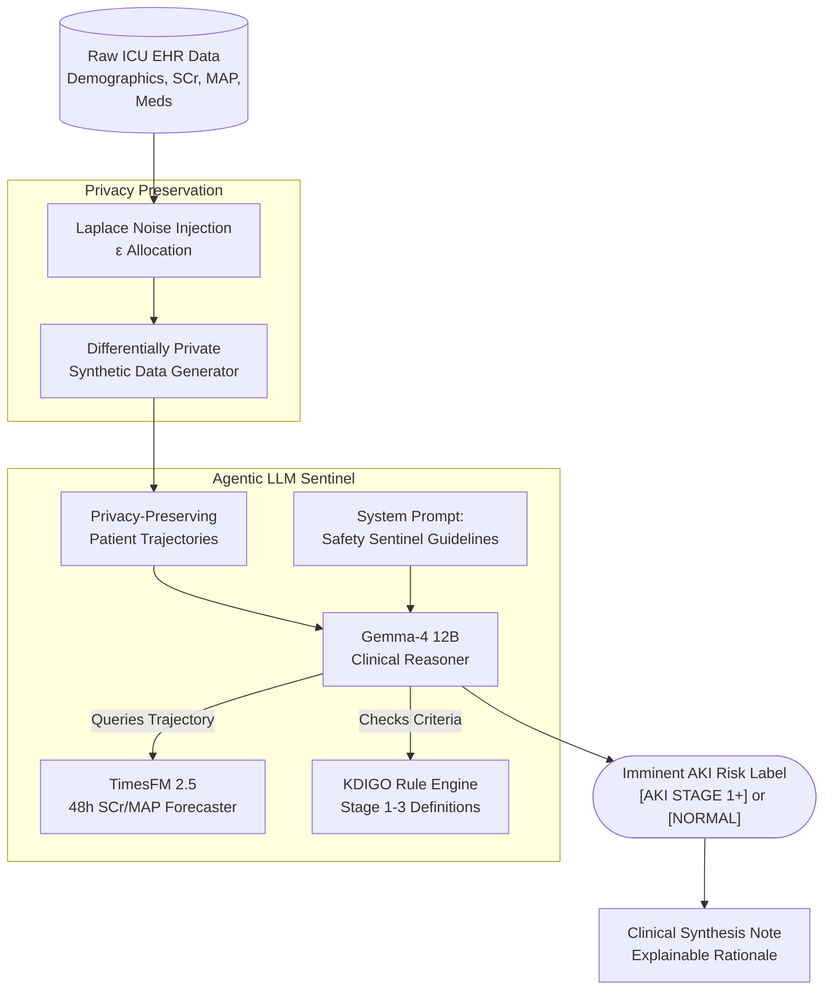

# **An Agentic LLM–Time Series Framework for Predicting Drug-Induced Acute Kidney Injury: A Privacy-Preserving Approach Using Synthetic EHR Data**

## **Background**

Acute kidney injury (AKI) causes a rapid decline in renal excretory function, resulting in the accumulation of metabolic waste products, fluid overload, and acid-base imbalances [1]. In the intensive care unit (ICU), AKI affects up to 50% of patients [1] and increases mortality to 26.9%—nearly four times higher than in critically ill patients without renal impairment [1, 2]. Severe cases requiring continuous renal replacement therapy account for 15% to 25% of total hospital costs [1].

The Kidney Disease: Improving Global Outcomes (KDIGO) criteria standardize the diagnosis and staging of AKI using static threshold elevations in serum creatinine and sustained reductions in urine output [3]. However, these biomarkers are lagging indicators [4]. Structural renal damage, such as acute tubular necrosis (ATN), typically precedes measurable changes in serum creatinine by hours or days [4].

Drug-induced acute kidney injury (DI-AKI) accounts for 19% to 26% of all hospital-acquired AKI cases [2, 5]. DI-AKI arises from exposure to nephrotoxic medications, including broad-spectrum antibiotics, antineoplastic agents, and intravenous contrast media [2, 5]. Because the pathophysiology of DI-AKI varies by pharmacological class and patient phenotype, generalized predictive models struggle to capture the drug-specific temporal trajectories required to identify impending toxicity [5, 6].

Predictive algorithms that use longitudinal electronic health record (EHR) data address the diagnostic latency in biomarker surveillance. Deep learning architectures, such as Recurrent Neural Networks (RNNs), Long Short-Term Memory (LSTM) networks, and Gradient-Boosted Decision Trees (GBDTs), process variable-length time-series data to track physiological decline [6, 7]. While these algorithms provide extended lead times, they lack clinical interpretability, generalize poorly across disparate healthcare systems, and cannot dynamically synthesize unstructured clinical narratives or apply medical guidelines [8, 9, 10].

Agentic Large Language Models (LLMs) overcome these limitations by executing complex clinical reasoning [11, 12]. In an agentic framework, an LLM retrieves external medical knowledge, executes code to query databases, and routes patient cases to specialized, drug-specific predictive models [11, 12]. These agents bridge the gap between raw algorithmic output and protocol-constrained clinical decision support [12].

However, data privacy constraints restrict the development and external validation of multi-modal, agentic systems on real-world EHRs. To address this, generative architectures like Generative Adversarial Networks (GANs) produce synthetic data that mathematically guarantee differential privacy while preserving the longitudinal and multivariate distributions of real-world patient trajectories [13, 14]. Integrating robust time-series forecasting, agentic LLM orchestration, and synthetic EHR infrastructure enables the prediction and interpretation of DI-AKI.

## **Current Evidence**

### **High-Dimensional Time-Series Forecasting for General Acute Kidney Injury**

Continuous prediction frameworks using RNN architectures analyze massive retrospective EHR datasets to forecast renal risk. Tomašev et al. analyzed 703,782 adult patients and predicted 55.8% of all inpatient AKI episodes and 90.2% of severe AKI cases requiring dialysis [4]. The model provided up to a 48-hour lead time, maintaining a ratio of 2 false alerts for every true alert [4].

Subsequent ICU-focused models integrated structured time-series measurements with unstructured clinical notes. Tan et al. developed a multimodal framework using the MIMIC-IV database that achieved an Area Under the Receiver Operating Characteristic Curve (AUROC) of 0.888 for general AKI prediction and 0.997 for dialysis forecasting, with a 12-hour lead time [7]. 

External validation studies show that model performance relies on strict adherence to KDIGO labeling. Lyu et al. demonstrated that integrating temporal urine output alongside serum creatinine improved prediction over creatinine-only models [3]. Alfieri et al. validated a continuous machine learning model across 16,760 ICU patients in three countries, consistently predicting severe injury at least 14 hours in advance [8]. Similarly, Hourani et al. deployed an interpretable XGBoost model that achieved an internal AUC of 0.88 and maintained external geographic validation (AUC 0.82) [9].

### **The Complexities of Drug-Induced Nephrotoxicity**

Accurate DI-AKI modeling requires incorporating pharmacokinetic parameters such as cumulative drug dose, duration of exposure, and therapeutic concentration [11]. In the Drug-Induced Renal Injury Consortium (DIRECT) study, an L1-regularized multivariable logistic regression model achieved an AUROC of 0.86 by identifying acute serum creatinine trends, baseline vascular capacity, and concurrent contrast media exposure as primary predictors of toxicity [12].

To operationalize DI-AKI prediction, Griffin et al. evaluated 14,480 hospitalized adults exposed to high-risk nephrotoxic regimens [13]. Their Gated Recurrent Unit (GRU) RNN predicted AKI within 48 hours and reduced false alerts from 2.5 to 0.7 per true AKI case [13]. 

Because toxicity profiles vary by agent, researchers have developed drug-specific predictors. For colistin-induced nephrotoxicity, categorical boosting achieved an AUROC of 0.823 and identified a toxicity threshold at a cumulative dosage of 4.0 mg/kg/day [14]. For vancomycin, stacking ensemble algorithms achieved an AUROC of 0.940 by relying on glucose variability, patient age, and baseline creatinine [15]. Heo et al. evaluated vancomycin toxicity across a 6-hospital network using an Interpretable Multivariable LSTM, achieving an AUROC of 0.920 with a median onset of 12 days [16]. For cisplatin, a CatBoost classification model yielded a ROC-AUC of 0.780 and used SHapley Additive exPlanations (SHAP) to identify concurrent intravenous magnesium administration as a protective variable [18].

### **Agentic Large Language Models in Clinical Decision Support**

Quantitative deep learning predictors do not autonomously synthesize missing variables or provide human-readable clinical rationale [10, 19]. Agentic LLM frameworks address this by iteratively planning, executing external tools, and interpreting the results.

Unaugmented LLMs output incorrect responses in 33% of clinical calculations due to arithmetic hallucinations [19]. Augmenting models with code interpreters reduces these errors [19]. Jin et al. developed AgentMD, an autonomous language agent that curated and executed 2,164 clinical calculators from the biomedical literature, achieving an accuracy of 87.7% on the RiskQA benchmark [20]. Liu et al. developed RiskAgent to collaborate with clinical decision tools across 387 disease risk scenarios, achieving an accuracy of 76.33% across 12,352 complex clinical questions [21].

For longitudinal EHR tabular data, EHRAgent directly interacts with structured databases by generating Python or SQL code [22]. It improved the success rate of complex clinical reasoning tasks by 29.6% over non-agentic baselines [22].

In nephrology, multi-agent frameworks are emerging. The ColaCare architecture fuses numerical expert model outputs with LLM-driven reasoning reports, improving mortality and readmission prediction [23]. Gordon et al. introduced AKIBoards, a structure-following multi-agent system utilizing a global model as a prior belief matrix. This architecture achieved an Average Precision (AP) of 0.195 in predicting AKI 48 hours before onset [24]. Shi et al. designed AKI-Detector, combining structured EHR machine learning with Retrieval-Augmented Generation (RAG). It achieved an accuracy of 0.827 and an F1-score of 0.600 on the MIMIC-IV cohort by grounding LLM reasoning directly in algorithmic predictions [25].

### **Privacy-Preserving Synthetic Electronic Health Records**

Training complex agentic architectures requires massive datasets that violate hospital privacy protocols. Synthetic EHR generation provides a mathematically rigorous solution. Yoon et al. developed EHR-Safe using sequential encoder-decoder networks and GANs. Predictive models trained exclusively on EHR-Safe synthetic data demonstrated less than a 3% difference in accuracy compared to models trained on original data, successfully mitigating re-identification risks [26].

Wang et al. developed IGAMT to process complex combinations of temporal features and discrete static variables while enforcing differential privacy (DP) budgets [27]. IGAMT outperformed traditional autoencoder baselines in downstream clinical utility [27].

Synthetic data integration directly improves DI-AKI predictive modeling by resolving class imbalances. Ramazani et al. evaluated patients receiving concurrent vancomycin and ceftazidime/avibactam. Because only 4.3% of patients experienced AKI, standard algorithmic training failed [28]. Using Inverse Probability of Treatment Weighting and Tabular GANs to generate synthetic trajectories, they identified a Hazard Ratio of 3.47 compared to vancomycin alone [28]. XGBoost classifiers augmented with this synthetic data increased the F1-score for 30-day AKI prediction to 0.80 [28].

## **Justification and Aim**

Robust longitudinal AKI forecasting models exist, but they operate independently from the causal, drug-specific etiologies required for targeted intervention. While tool-using clinical LLM agents execute static medical calculators, they have not been integrated as dynamic orchestration layers that route evolving patient trajectories to specific nephrotoxicity models. Furthermore, because training this integrated system requires massive data exposures that violate institutional privacy boundaries, differential privacy through synthetic EHR generation is a required infrastructure.

The aim of this review is to evaluate the literature regarding longitudinal AKI prediction, drug-induced nephrotoxicity, agentic LLMs, and synthetic data generation. This evaluation defines an evidence-based roadmap for developing an integrated Agentic LLM–Time Series framework to predict drug-induced acute kidney injury while adhering to data privacy protocols.

## **Conceptual Framework**

To concretize these objectives, we propose a dual-model, agentic orchestration architecture that pairs an LLM reasoning engine (Gemma-4) with a dedicated time-series forecasting model (TimesFM). As illustrated in Figure 1, the architecture does not passively pass text into a static classifier. Instead, the LLM actively parses the unstructured clinical narrative and structured flowsheet data to identify specific nephrotoxic exposures (e.g., Vancomycin and Piperacillin-Tazobactam co-administration). Upon detecting these exposures, the LLM utilizes a strict tool-calling protocol to extract temporal covariates and invoke the TimesFM forecaster mid-inference. 

The TimesFM model computes a 48-hour serum creatinine trajectory based on the extracted parameters and returns this quantitative forecast directly into the LLM’s context window. Finally, the LLM applies established KDIGO threshold logic to the projected creatinine values, synthesizing the temporal data and pharmacological context into an auditable, human-readable clinical assessment. This dynamic routing mechanism directly addresses the drug-specific heterogeneity highlighted in the literature by guaranteeing that quantitative forecasting is invoked only when clinically justified by the patient's exposure history.

*Figure 1: Conceptual architecture demonstrating the integration of a privacy-preserving data pipeline with dynamic agentic routing, where the LLM orchestrates mid-inference calls to a specialized time-series forecasting model.*

## **Reference List**

1. Yang M, Liu S, Hao T, Ma C, Chen H, Li Y, Wu C, Xie J, Qiu H, Li J, Yang Y, Liu C. Development and validation of a deep interpretable network for continuous acute kidney injury prediction in critically ill patients. Artif Intell Med. 2024;149:102785.  
2. Kom IARY, Dongelmans D, Abu-Hanna A, Schut M, de Lange DD, van Roon EV, de Jonge E, Bouman C, de Keizer ND, Jager K, Klopotowska JE. Acute kidney injury associated with nephrotoxic drugs in critically ill patients: a multicenter cohort study using electronic health record data. Clin Kidney J. 2023;16(12):2549-2558.  
3. Lyu X, Fan B, Hüser M, Hartout P, Gumbsch T, Faltys M, Merz T, Rätsch G, Borgwardt KM. An empirical study on KDIGO-defined acute kidney injury prediction in the intensive care unit. Bioinformatics. 2024;40(Supplement\_1):i247-i256.  
4. Tomašev N, Glorot X, Rae JW, Zielinski M, Askham H, Saraiva A, Mottram A, Meyer C, Ravuri SV, Protsyuk IV, Connell A, Hughes CO, Karthikesalingam A, Cornebise J, Montgomery H, Rees G, Laing C, Baker C, Peterson KS, Reeves R, Hassabis D, King D, Suleyman M, Back T, Nielson C, Ledsam J, Mohamed S. A Clinically Applicable Approach to Continuous Prediction of Future Acute Kidney Injury. Nature. 2019;572(7767):116-119.  
5. Mehta R, Awdishu L, Davenport A, Murray P, Macedo E, Cerdá J, Chakaravarthi R, Holden AL, Goldstein S. Phenotype Standardization for Drug Induced Kidney Disease. Kidney Int. 2015;88(2):226-234.  
6. Bashiri FS, Carey K, Martin J, Koyner J, Edelson D, Gilbert E, Mayampurath A, Afshar M, Churpek M. Development and external validation of deep learning clinical prediction models using variable-length time series data. J Am Med Inform Assoc. 2024;31(4):ocae088.  
7. Tan Y, Dede M, Mohanty V, Dou J, Hill H, Bernstam EV, Chen K. Forecasting acute kidney injury and resource utilization in ICU patients using longitudinal, multimodal models. J Biomed Inform. 2024;154:104648.  
8. Alfieri F, Ancona A, Tripepi G, Rubeis A, Arjoldi N, Finazzi S, Cauda V, Fagugli R. Continuous and early prediction of future moderate and severe Acute Kidney Injury in critically ill patients: Development and multi-centric, multi-national external validation of a machine-learning model. PLoS One. 2023;18(7):e0287398.  
9. Hourani A, Jakubowska Z, Małyszko J. Forecasting ICU Acute Kidney Injury with Actionable Lead Time Using Interpretable Machine Learning: Development and Multi-Center Validation. J Clin Med. 2026;15(3):1191.  
10. Vagliano I, Chesnaye N, Leopold J, Jager K, Abu-Hanna A, Schut M. Machine learning models for predicting acute kidney injury: a systematic review and critical appraisal. Clin Kidney J. 2022;15(12):2266-2280.  
11. Yousif ZK, Awdishu L. Drug-Induced Acute Kidney Injury Risk Prediction Models. Nephron. 2023;147(1):44-47.  
12. Yousif ZK, Koola JD, Macedo E, Cerda J, Goldstein SL, Chakravarthi R, Lewington A, Selewski D, Zappitelli M, Cruz D, Tolwani A. Clinical Characteristics and Outcomes of Drug-Induced Acute Kidney Injury Cases. Kidney Int Rep. 2023;8(12):2400-2410.  
13. Griffin BR, Mudireddy A, Horne B, Chonchol M, Goldstein S, Goto M, Matheny ME, Street WN, Vaughan-Sarrazin M, Jalal DI, Misurac J. Predicting Nephrotoxic Acute Kidney Injury in Hospitalized Adults: A Machine Learning Algorithm. Kidney Med. 2024;6(12):100918.  
14. Chiu LW, et al. Machine Learning Algorithms to Predict Colistin-Induced Nephrotoxicity from Electronic Health Records in Patients with Multidrug-Resistant Gram-Negative Infection. Int J Antimicrob Agents. 2024;64(4):107175.  
15. Aghamirzaei F, Abin AA, Futuhi F. An Ensemble Machine Learning Model for Early Prediction of Vancomycin-Induced Acute Kidney Injury in ICU Patients. Arch Acad Emerg Med. 2025;13(1):e45.  
16. Heo S, Kang E, Yu J, Kim H, Lee S, Kim K, Hwangbo Y, Park RW, Shin H, Ryu K, Kim C, Jung H, Chegal Y, Lee JH, Park Y. Time Series AI Model for Acute Kidney Injury Detection Based on a Multicenter Distributed Research Network: Development and Verification Study. JMIR Med Inform. 2023;12(1):e47693.  
17. Fan J, et al. Development and Validation of a CatBoost-Based Model for Predicting Significant Creatinine Elevation in ICU Patients Receiving Vancomycin Therapy. BioMedInformatics. 2025;5(1):234-245.  
18. Ambe K, Aoki Y, Murashima M, Wachino C, Deki Y, Ieda M, Kondo M, Furukawa-Hibi Y, Kimura K, Hamano T, Tohkin M. Prediction of Cisplatin-Induced Acute Kidney Injury Using an Interpretable Machine Learning Model and Electronic Medical Record Information. Clin Transl Sci. 2025;18(1):e70115.  
19. Goodell AJ, Chu SN, Rouholiman D, Chu LF. Large language model agents can use tools to perform clinical calculations. NPJ Digit Med. 2025;8(1):38.  
20. Jin Q, Wang Z, Yang Y, Zhu Q, Wright D, Huang T, Khandekar N, Wan N, Ai X, Wilbur WJ, He Z, Taylor RA, Chen Q, Lu Z. AgentMD: Empowering language agents for risk prediction with large-scale clinical tool learning. Nat Commun. 2025;16(1):64430.  
21. Liu F, Wu J, Zhou H, Gu X, Molaei S, Thakur A, Clifton L, Wu H, Clifton DA. RiskAgent: Autonomous Medical AI Copilot for Generalist Risk Prediction. ArXiv \[Preprint\]. 2025:2503.03802.  
22. Shi W, Xu R, Zhuang Y, Yu Y, Zhang J, Wu H, Zhu Y, Ho JC, Yang C, Wang MD. EHRAgent: Code Empowers Large Language Models for Few-shot Complex Tabular Reasoning on Electronic Health Records. Proc Conf Empir Methods Nat Lang Process. 2024;2024:22315-22339.  
23. Wang Z, Zhu Y, Zhao H, Zheng X, Wang T, Tang W, Wang Y, Pan C, Harrison EM, Gao J, Ma L. ColaCare: Enhancing Electronic Health Record Modeling through Large Language Model-Driven Multi-Agent Collaboration. Proc ACM Web Conf. 2025;3696410.3714877.  
24. Gordon D, Petousis P, Nicholas SB, Bui AAT. AKIBoards: A Structure-Following Multiagent System for Predicting Acute Kidney Injury. ArXiv \[Preprint\]. 2025:2504.20368.  
25. Shi T, Xiao M, Xu H, Zhao H, Kong G. AKI-Detector: A Multi-Agent Framework by Integrating Machine Learning and Large Language Models for Early Prediction of Acute Kidney Injury in ICU. AMIA Annu Symp Proc. 2024;2024:1190-1199.  
26. Yoon J, Mizrahi M, Ghalaty NF, Jarvinen T, Ravi AS, Brune P, Kong F, Anderson D, Lee G, Meir A, Bandukwala F, Kanal E, Arık SÖ, Pfister T. EHR-Safe: generating high-fidelity and privacy-preserving synthetic electronic health records. NPJ Digit Med. 2023;6(1):141.  
27. Wang W, Tang P, Lou J, Shao Y, Waller L, Ko YA, Xiong L. IGAMT: Privacy-Preserving Electronic Health Record Synthesization with Heterogeneity and Irregularity. Proc AAAI Conf Artif Intell. 2024;38(14):15634-15643.  
28. Ramazani M, Brothers T, Ahmed I, Al-Mamun MA. Synthetic Data-Driven Early Prediction Framework for Acute Kidney Injury in Patients Receiving Vancomycin and Ceftazidime/Avibactam. Pharmacotherapy. 2025;46(1):70064.
