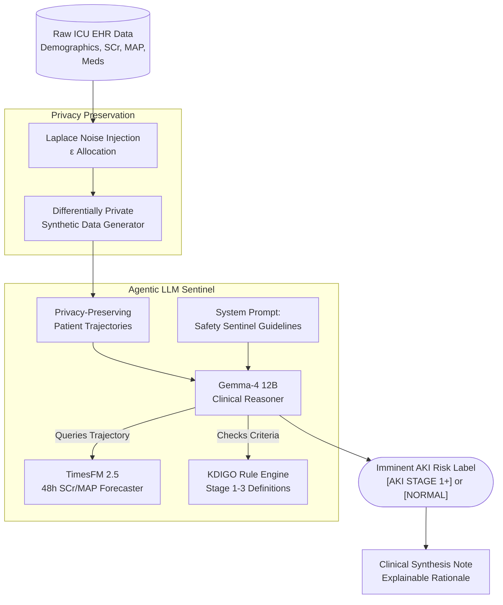

# **An Agentic LLM–Time Series Framework for Predicting Drug-Induced Acute Kidney Injury: A Privacy-Preserving Approach Using Synthetic EHR Data**

## **Background**

Acute kidney injury (AKI) affects up to 50% of patients in the intensive care unit (ICU) [1] and increases mortality to 26.9%—nearly four times higher than in critically ill patients without renal impairment [1, 2]. Severe cases requiring continuous renal replacement therapy account for 15% to 25% of total hospital costs [1].

The Kidney Disease: Improving Global Outcomes (KDIGO) criteria standardize the diagnosis and staging of AKI using static threshold elevations in serum creatinine and sustained reductions in urine output [3]. These biomarkers are lagging indicators [4]. Structural renal damage, such as acute tubular necrosis, typically precedes measurable changes in serum creatinine by hours or days [4].

Drug-induced acute kidney injury (DI-AKI) accounts for 19% to 26% of all hospital-acquired AKI cases [2, 5]. DI-AKI arises from exposure to nephrotoxic medications, including broad-spectrum antibiotics, antineoplastic agents, and intravenous contrast media [2, 5]. Because the pathophysiology of DI-AKI varies by pharmacological class and patient phenotype, generalized predictive models fail to capture the drug-specific temporal trajectories required to identify impending toxicity [5, 6].

Predictive algorithms using longitudinal electronic health record (EHR) data address the diagnostic latency of biomarker surveillance. Deep learning architectures process variable-length time-series data to track physiological decline [6, 7]. While these algorithms provide extended lead times, they lack clinical interpretability, fail to generalize across disparate healthcare systems, and cannot dynamically synthesize unstructured clinical narratives or apply medical guidelines [8, 9, 10].

Agentic Large Language Models (LLMs) address these limitations by executing multi-step clinical reasoning [11, 12]. In an agentic framework, an LLM retrieves external medical knowledge, executes code to query databases, and routes patient cases to specialized, drug-specific predictive models [11, 12]. These agents translate raw algorithmic output into protocol-constrained clinical decision support [12].

Data privacy constraints restrict the development and external validation of multi-modal, agentic systems on real-world EHRs. Generative architectures like Generative Adversarial Networks (GANs) produce synthetic data that mathematically guarantee differential privacy while preserving the longitudinal and multivariate distributions of real-world patient trajectories [13, 14]. Integrating time-series forecasting, agentic LLM orchestration, and synthetic EHR infrastructure enables the secure prediction and interpretation of DI-AKI.

## **Current Evidence**

### **High-Dimensional Time-Series Forecasting for General Acute Kidney Injury**

Continuous prediction frameworks using RNN architectures analyze massive retrospective EHR datasets to forecast renal risk. Tomašev et al. analyzed 703,782 adult patients and predicted 55.8% of all inpatient AKI episodes and 90.2% of severe AKI cases requiring dialysis [4]. The model provided up to a 48-hour lead time, maintaining a ratio of 2 false alerts for every true alert [4].

Subsequent ICU-focused models integrated structured time-series measurements with unstructured clinical notes. Tan et al. developed a multimodal framework using the MIMIC-IV database that achieved an Area Under the Receiver Operating Characteristic Curve (AUROC) of 0.888 for general AKI prediction and 0.997 for dialysis forecasting, with a 12-hour lead time [7]. 

External validation studies show that model performance relies on strict adherence to KDIGO labeling. Lyu et al. demonstrated that integrating temporal urine output alongside serum creatinine improved prediction over creatinine-only models [3]. Alfieri et al. validated a continuous machine learning model across 16,760 ICU patients in three countries, predicting severe injury at least 14 hours in advance [8]. Hourani et al. deployed an interpretable XGBoost model that achieved an internal AUC of 0.88 and maintained external geographic validation (AUC 0.82) [9].

### **The Complexities of Drug-Induced Nephrotoxicity**

Accurate DI-AKI modeling requires incorporating pharmacokinetic parameters such as cumulative drug dose, duration of exposure, and therapeutic concentration [11]. In the Drug-Induced Renal Injury Consortium (DIRECT) study, an L1-regularized multivariable logistic regression model achieved an AUROC of 0.86 by identifying acute serum creatinine trends, baseline vascular capacity, and concurrent contrast media exposure as primary predictors of toxicity [12].

To operationalize DI-AKI prediction, Griffin et al. evaluated 14,480 hospitalized adults exposed to high-risk nephrotoxic regimens [13]. Their Gated Recurrent Unit (GRU) RNN predicted AKI within 48 hours and reduced false alerts from 2.5 to 0.7 per true AKI case [13]. 

Because toxicity profiles vary by agent, researchers construct drug-specific predictors. For colistin-induced nephrotoxicity, categorical boosting achieved an AUROC of 0.823 and identified a toxicity threshold at a cumulative dosage of 4.0 mg/kg/day [14]. For vancomycin, stacking ensemble algorithms achieved an AUROC of 0.940 by analyzing glucose variability, patient age, and baseline creatinine [15]. Heo et al. evaluated vancomycin toxicity across a 6-hospital network using an Interpretable Multivariable LSTM, achieving an AUROC of 0.920 with a median onset of 12 days [16]. For cisplatin, a CatBoost classification model yielded a ROC-AUC of 0.780 and used SHapley Additive exPlanations (SHAP) to identify concurrent intravenous magnesium administration as a protective variable [18].

### **Agentic Large Language Models in Clinical Decision Support**

Quantitative deep learning predictors do not autonomously synthesize missing variables or provide human-readable clinical rationale [10, 19]. Agentic LLM frameworks address this by iteratively planning, executing external tools, and interpreting the results.

Unaugmented LLMs output incorrect responses in 33% of clinical calculations due to arithmetic hallucinations [19]. Augmenting models with code interpreters reduces these errors [19]. Jin et al. developed AgentMD, an autonomous language agent that curated and executed 2,164 clinical calculators from the biomedical literature, achieving an accuracy of 87.7% on the RiskQA benchmark [20]. Liu et al. developed RiskAgent to collaborate with clinical decision tools across 387 disease risk scenarios, achieving an accuracy of 76.33% across 12,352 complex clinical questions [21].

For longitudinal EHR tabular data, EHRAgent directly interacts with structured databases by generating Python or SQL code [22]. It improved the success rate of complex clinical reasoning tasks by 29.6% over non-agentic baselines [22].

In nephrology, multi-agent frameworks are emerging. The ColaCare architecture fuses numerical expert model outputs with LLM-driven reasoning reports, improving mortality and readmission prediction [23]. Gordon et al. introduced AKIBoards, a structure-following multi-agent system utilizing a global model as a prior belief matrix, achieving an Average Precision (AP) of 0.195 in predicting AKI 48 hours before onset [24]. Shi et al. designed AKI-Detector, combining structured EHR machine learning with Retrieval-Augmented Generation (RAG). It achieved an accuracy of 0.827 and an F1-score of 0.600 on the MIMIC-IV cohort by grounding LLM reasoning directly in algorithmic predictions [25].

### **Privacy-Preserving Synthetic Electronic Health Records**

Training complex agentic architectures requires massive datasets that violate hospital privacy protocols. Synthetic EHR generation provides a mathematically rigorous solution. Yoon et al. developed EHR-Safe using sequential encoder-decoder networks and GANs. Predictive models trained exclusively on EHR-Safe synthetic data demonstrated less than a 3% difference in accuracy compared to models trained on original data, mitigating re-identification risks [26].

Wang et al. developed IGAMT to process complex combinations of temporal features and discrete static variables while enforcing differential privacy (DP) budgets [27]. IGAMT outperformed traditional autoencoder baselines in downstream clinical utility [27].

Synthetic data integration directly improves DI-AKI predictive modeling by resolving class imbalances. Ramazani et al. evaluated patients receiving concurrent vancomycin and ceftazidime/avibactam. Because only 4.3% of patients experienced AKI, standard algorithmic training failed [28]. Using Inverse Probability of Treatment Weighting and Tabular GANs to generate synthetic trajectories, they identified a Hazard Ratio of 3.47 compared to vancomycin alone [28]. XGBoost classifiers augmented with this synthetic data increased the F1-score for 30-day AKI prediction to 0.80 [28].

## **Justification and Aim**

Robust longitudinal AKI forecasting models exist, but they operate independently from the causal, drug-specific etiologies required for targeted intervention. While tool-using clinical LLM agents execute static medical calculators, researchers have not integrated them as dynamic orchestration layers that route evolving patient trajectories to specific nephrotoxicity models. Because training this integrated system requires massive data exposures that violate institutional privacy boundaries, differential privacy through synthetic EHR generation is a required infrastructure.

We aim to construct and evaluate an integrated Agentic LLM–Time Series framework that predicts drug-induced acute kidney injury while adhering to strict data privacy protocols.

## **Conceptual Framework**

We propose a dual-model, agentic orchestration architecture that pairs an LLM reasoning engine (Gemma-4) with a dedicated time-series forecasting model (TimesFM). As illustrated in Figure 1, the LLM actively parses the unstructured clinical narrative and structured flowsheet data to identify specific nephrotoxic exposures (e.g., Vancomycin and Piperacillin-Tazobactam co-administration). Upon detecting these exposures, the LLM utilizes a strict tool-calling protocol to extract temporal covariates and invoke the TimesFM forecaster mid-inference. 

The TimesFM model computes a 48-hour serum creatinine trajectory based on the extracted parameters and returns this quantitative forecast directly into the LLM’s context window. Finally, the LLM applies established KDIGO threshold logic to the projected creatinine values, synthesizing the temporal data and pharmacological context into an auditable, human-readable clinical assessment. This dynamic routing mechanism directly addresses the drug-specific heterogeneity highlighted in the literature by guaranteeing that quantitative forecasting is invoked only when clinically justified by the patient's exposure history.

*Figure 1: Conceptual architecture demonstrating the integration of a privacy-preserving data pipeline with dynamic agentic routing, where the LLM orchestrates mid-inference calls to a specialized time-series forecasting model.*
