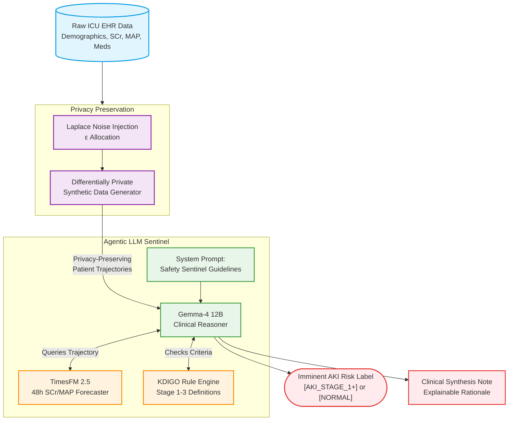

# System Architecture Diagram

This Mermaid diagram illustrates the end-to-end pipeline of the DIKD AKI prediction system, from raw EHR data ingestion, through the Differential Privacy mechanism, into the Agentic LLM framework.

## How to use this diagram in the manuscript:
If the target journal accepts Mermaid diagrams directly (some online HTML platforms do), you can paste the block above. If the journal requires a standard image format (PDF/PNG), you can use the [Mermaid Live Editor](https://mermaid.live/) to copy-paste this code and export it as a high-resolution SVG or PNG for publication.
