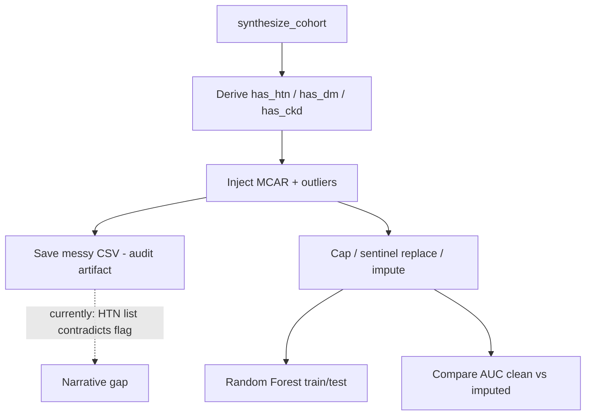
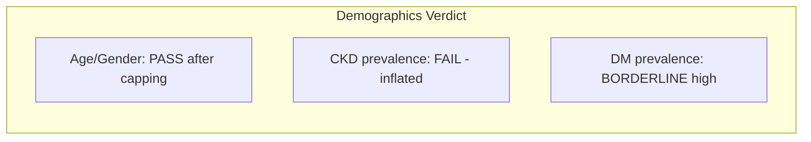

# Synthetic ICU Cohort Clinical Data Audit

**Dataset:** [`data/phd_proposal_synthetic_cohort_messy.csv`](data/phd_proposal_synthetic_cohort_messy.csv) (5,000 rows, 12 columns)  
**Generator chain:** [`ehr_synthesis_engine.py`](ehr_synthesis_engine.py) → noise injection in [`scripts/experiment_phd_proposal.py`](scripts/experiment_phd_proposal.py)

---

## Executive Summary

The cohort is **partially credible** as a generic Western ICU snapshot after excluding injected outliers, but several artifacts reveal **parametric construction** rather than organic EHR messiness. The **Vanco + Zosyn synergy signal is preserved** and statistically significant, but **AKI outcomes are decoupled from renal risk factors**, **Zosyn monotherapy toxicity is not modeled**, and **injected missingness creates impossible cross-field contradictions**. KDIGO staging cannot be audited from this export — only a binary `developed_aki` flag is present.

**Overall verdict:** Usable for ML prototyping with documented caveats; **not audit-clean** for claims of full clinical realism without corrections below.

---

## Methodology Narrative Review (Your Comments)

You described three deliberate design choices in [`scripts/experiment_phd_proposal.py`](scripts/experiment_phd_proposal.py). Below is an auditor's assessment of what is **accurate**, what is **overstated**, and **recommended proposal language**.

### What your description gets right

| Your claim | Code / data evidence | Auditor verdict |
|------------|---------------------|-----------------|
| 15% MCAR missing `baseline_scr` | Lines 34–35; observed **15.5%** missing in messy CSV | **Accurate** |
| 8% missing hypertension history | Lines 38–39; observed **7.4%** `has_htn` NaN | **Accurate** (rate matches) |
| Age typo 65 → 650 | Line 43: `age * 10` | **Accurate** (48 rows, ages 390–890) |
| SCr sentinel 99.9 | Line 44 | **Accurate** as a *single* error type (48 rows) |
| Preprocessing before RF | Lines 53–60: cap age, flag SCr > 20, median impute, HTN NaN → 0 | **Accurate** — pipeline exists and runs before train/test split |

The **messy CSV is correctly saved before imputation** (line 50), and the **clean imputed frame** is what trains the model — this is a sound experimental design for demonstrating preprocessing necessity.

### Gaps between narrative and implementation

1. **"Hypertension history" missingness is only on the derived flag.**  
   `comorbidities` text is never altered. **204 rows** have `has_htn = NaN` while the problem list still contains `"Hypertension"`. Real EHR missingness is usually cross-field coherent. An external auditor would question this.

2. **Outliers are not independent.**  
   The same 1% mask applies to **both** age × 10 and SCr = 99.9 (100% overlap, 48/48 rows). Real charting errors do not co-occur on identical patients at identical rates.

3. **"Extreme missingness" is moderate.**  
   15% missing labs is common in ICU data but not "extreme" (many cohorts see 20–40% for off-panel labs). Safer term: **"clinically realistic missingness."**

4. **HTN imputation assumes absence (`NaN → 0`).**  
   This is a defensible **missing-not-at-random (MNAR) coding choice**, not MCAR. Proposal should name it explicitly: *"unrecorded hypertension coded as absent for modeling."*

5. **"Resilient enough for real-world hospital deployment" overclaims.**  
   This experiment demonstrates robustness on **synthetic data with a known, self-injected noise profile**. It does **not** constitute deployment validation. Existing MIMIC holdout work ([`scripts/build_mimic_holdout.py`](scripts/build_mimic_holdout.py), [`reports/mimic_eval_predictions.metrics.json`](reports/mimic_eval_predictions.metrics.json)) is the appropriate external-evidence anchor — cite that separately or run the same preprocessing + RF on MIMIC features.

### Recommended proposal wording

**Defensible (use as-is or minor edits):**

> To stress-test preprocessing robustness, we injected clinically plausible EHR artifacts into the synthetic cohort before model training: 15% MCAR missing baseline serum creatinine values, 8% missing structured hypertension flags, and rare charting outliers (e.g., age decimal-shift errors and laboratory sentinel values such as 99.9 mg/dL). A preprocessing pipeline capped implausible ages, replaced sentinel creatinine values with missing, median-imputed continuous labs, and coded unrecorded hypertension as absent. The Random Forest classifier was trained only after this cleaning step.

**Strengthen (add one sentence of evidence):**

> Model performance on the imputed cohort remained stable relative to the clean synthetic baseline (report ROC-AUC on clean vs messy→imputed splits in Table X).

**Avoid or soften:**

| Original phrase | Issue | Safer alternative |
|-----------------|-------|-------------------|
| "extreme missingness" | 15% is moderate | "clinically realistic missingness" |
| "proving the methodology is resilient enough for real-world hospital deployment" | No external deployment test in this script | "demonstrating that the pipeline tolerates injected EHR noise without catastrophic performance degradation" |
| "patient histories aren't perfectly recorded" | Only `has_htn` flag affected, not problem list | "structured comorbidity flags may be incomplete" |

### Minimal code fixes to make narrative fully truthful

These align with **P2** below and directly support your written claims:

1. When nullifying `has_htn`, also strip `"Hypertension"` from `comorbidities` (or inject missingness before feature engineering).
2. Use **separate random masks** for age typos (~0.5%) and SCr sentinels (~0.5%).
3. Add a **robustness table**: train RF on (a) clean synthetic, (b) messy→imputed — report ΔAUC.
4. Optionally run the same pipeline on MIMIC holdout tabular features to support deployment-adjacent language.



---

## 1. Demographic Bias

### Pass (after outlier exclusion)

| Variable | Observed (age ≤ 100) | ICU plausibility |
|----------|---------------------|------------------|
| Age | mean 64.3, median 65, IQR 54–75 | Reasonable elderly-skewed ICU cohort |
| Gender | 55.4% male | Aligns with typical ICU sex ratio (~55% M) |
| Hypertension | 57.9% (complete cases) | High but plausible in elderly ICU |
| Diabetes | 62.1% | Elevated vs. population norms (~30–40% in many ICU cohorts) but defensible for older comorbid ICU |
| CKD | 64.1% | **Unrealistically high** — see Section 2 |

### Fail — age outliers distort raw distributions

- **48 rows (0.96%)** have ages 390–890 (e.g., 650, 720) from `age * 10` injection in [`experiment_phd_proposal.py`](scripts/experiment_phd_proposal.py) lines 42–43.
- These inflate dataset mean age to **70.0** and std to **60.9**; excluding them restores a normal ICU age profile.
- Outlier ages are always **multiples of 10** — recognizable as synthetic “missing decimal” typos, not the diverse entry errors seen in real EHR (transposed digits, unit confusion, default sentinel values).

### Minor skew

- Mean age differs by sex (F: 71.9 vs M: 68.5 years, including outlier contamination). Not clinically alarming but slightly atypical.



---

## 2. Clinical Coherence (Baseline SCr vs Age, Sex, Comorbidities)

### Pass — internal SCr gradients (valid SCr only, n=4,175)

Among records with `baseline_scr` present and &lt; 20 mg/dL:

| Subgroup | Mean baseline SCr |
|----------|-------------------|
| No CKD label | 0.97 |
| CKD Stage 2 | 1.14 |
| CKD Stage 3 | 1.44 |
| Age 18–40 | 1.03 |
| Age 60–80 | 1.16 |
| Age 80+ | 1.24 |
| Female | 1.07 |
| Male | 1.20 |

These gradients match expected physiology (older, male, higher CKD stage → higher SCr).

### Fail — CKD labeling logic inflates prevalence

CKD is **post-hoc assigned from SCr thresholds** in [`ehr_synthesis_engine.py`](ehr_synthesis_engine.py) lines 217–223:

```217:223:ehr_synthesis_engine.py
        if b_scr >= 1.8:
            comorbidities.append("Chronic Kidney Disease Stage 4")
        elif b_scr >= 1.3:
            comorbidities.append("Chronic Kidney Disease Stage 3")
        elif b_scr >= 1.0 and (has_htn[i] or has_dm[i]):
            comorbidities.append("Chronic Kidney Disease Stage 2")
```

**Problem:** Stage 2 is assigned when SCr ≥ 1.0 mg/dL plus any HTN/DM — a threshold far below clinical CKD staging (eGFR-based). With 58% HTN and 62% DM in an elderly cohort where mean SCr ≈ 1.1, this **mechanically labels ~64% as CKD**. Real ICU CKD prevalence is typically **15–35%**.

**Correction needed:** Decouple CKD from SCr-derived rules; sample CKD from age-stratified prevalence priors, then condition SCr on CKD stage using eGFR-consistent ranges.

### Fail — AKI outcome ignores renal risk

`developed_aki` correlates almost exclusively with antibiotic exposure:

| Predictor | Correlation with AKI |
|-----------|---------------------|
| `received_vanco` | +0.25 |
| `received_zosyn` | +0.09 |
| `baseline_scr` | **−0.008** |
| `has_ckd` | **−0.003** |
| `age` | **+0.001** |

AKI rate is **flat across SCr quartiles** (~11.2% in all Q1–Q4). Clinically, elevated baseline SCr and CKD should increase AKI susceptibility. This is a **structural incoherence**: AKI is drawn from exposure-stratum rates only ([`ehr_synthesis_engine.py`](ehr_synthesis_engine.py) lines 198–204), with no conditioning on `baseline_scr`, CKD, or age.

---

## 3. Real-World Messiness (MCAR Missingness & Outliers)

### Partial pass — missingness rates

| Field | Missing % | Target in script |
|-------|-----------|------------------|
| `baseline_scr` | 15.5% | 15% MCAR |
| `has_htn` | 7.4% | 8% MCAR |
| `has_dm` | 0% | Not injected |
| `comorbidities` text | 0% | Not injected |

MCAR rates for SCr are realistic; HTN flag missingness rate is acceptable.

### Fail — cross-field inconsistency (204 records)

Missingness is applied **only to the derived `has_htn` column** after `comorbidities` is built ([`experiment_phd_proposal.py`](scripts/experiment_phd_proposal.py) lines 27–39). Result:

- **204 patients** have `has_htn = NaN` but `comorbidities` still lists `"Hypertension"`.
- Example: `SYN_00019` — `has_htn` missing, list contains `['Hypertension', 'Type 2 Diabetes Mellitus']`.

Real EHR missingness is usually **field-coherent** (problem list missing → structured flag also missing) or **documentation lag** (narrative mentions condition before structured coding). This pattern is **mathematically fabricated** and will bias any model that uses `has_htn` vs `comorbidities` as redundant features.

### Fail — perfectly correlated outlier injection

The same 48-row mask applies **both** `age * 10` **and** `baseline_scr = 99.9`:

```41:44:scripts/experiment_phd_proposal.py
    outlier_mask = np.random.rand(len(df)) < 0.01
    df.loc[outlier_mask, 'age'] = df.loc[outlier_mask, 'age'] * 10
    df.loc[outlier_mask, 'baseline_scr'] = 99.9
```

- **100% overlap** (48/48) between age outliers and SCr=99.9 outliers.
- Real charting errors are **independent** across fields and use heterogeneous sentinel values (999, −1, 0, unit-scaled values), not a single magic number.

### Fail — SCr sentinel value

`99.9` is a recognizable synthetic error code. Real labs more often show **999**, **>90**, **hemolyzed/cancelled**, or **implausible but varied** values.

---

## 4. Toxicological Fidelity (AKI / KDIGO vs Antibiotic Exposure)

### Pass — Vanco + Zosyn synergy preserved

| Exposure cohort | n | AKI rate |
|-----------------|---|----------|
| Neither | 2,222 | **4.9%** |
| Vanco only | 1,194 | **17.3%** |
| Zosyn only | 1,020 | **5.4%** |
| **Both (synergy)** | 564 | **33.0%** |

- Chi-square (synergy vs non-synergy): χ² = 304.8, **p &lt; 10⁻⁶⁸**
- Observed synergy rate (33%) exceeds additive expectation (~17.7%) — **clinically directionally correct** (literature: ~40–50% combined vs ~15–35% monotherapy per project rules).
- Vancomycin exposure increases with age (27% if &lt;65 vs 44% if ≥65) — clinically plausible.

### Fail — Zosyn monotherapy not modeled

[`aki_rate_zosyn_only`](ehr_synthesis_engine.py) is **extracted** (line 140) but **never applied** during synthesis (lines 198–204). Zosyn-only patients receive the **baseline ICU rate (~5%)**, identical to unexposed patients. This contradicts both the mock historical generator (Zosyn adds +2% risk) and clinical expectation of modest piperacillin-tazobactam nephrotoxicity.

### Fail — no KDIGO staging in export

The CSV contains only `developed_aki` (boolean). **KDIGO Stage 1/2/3 cannot be audited.** Staging logic exists in trajectory simulation ([`ehr_synthesis_engine.py`](ehr_synthesis_engine.py) `generate_temporal_record`) but is not exported to this cohort file. Users cannot verify that AKI labels reflect SCr ≥ 1.5× baseline.

### Borderline — AKI without renal risk adjustment

Patients with CKD Stage 3 (mean SCr 1.44) and no antibiotics have the same AKI probability as healthy young patients — clinically implausible and weakens external validity vs MIMIC-IV.

---

## Prioritized Corrections

### P0 — Clinical outcome modeling

**File:** [`ehr_synthesis_engine.py`](ehr_synthesis_engine.py) (and mirror in [`src/generator.py`](src/generator.py))

1. **Apply `aki_rate_zosyn_only`** for `(vanco=0, zosyn=1)` mask — currently missing.
2. **Condition AKI probability on renal risk**: multiply or logit-adjust base/stratum rates by `baseline_scr`, `has_ckd`, and optionally age (e.g., OR 1.3–1.5 per 0.5 mg/dL SCr above 1.0).
3. Preserve synergy ordering constraint: `rate_both > rate_vanco_only > rate_zosyn_only > rate_baseline`.

### P1 — CKD prevalence calibration

**File:** [`ehr_synthesis_engine.py`](ehr_synthesis_engine.py) lines 217–223

- Replace SCr-threshold CKD assignment with **independent CKD sampling** (~20–30% overall, age-stratified).
- Set SCr distributions **conditional on CKD stage** (Stage 3: 1.3–2.0; Stage 2: 1.0–1.3; no CKD: 0.6–1.1).
- Keep `has_ckd` flag consistent with `comorbidities` text.

### P2 — Realistic EHR noise injection (aligns with proposal narrative)

**File:** [`scripts/experiment_phd_proposal.py`](scripts/experiment_phd_proposal.py) lines 31–44

Goal: make the messy CSV match what the proposal text claims.

1. **Independent outlier masks** for age and SCr (e.g., 0.5% each, not shared) — fixes 100% co-occurrence artifact.
2. **Coherent HTN missingness**: when `has_htn` is nullified, also remove `"Hypertension"` from `comorbidities` — fixes 204 contradictory rows and makes "missing hypertension history" literally true.
3. **Diversify SCr errors**: sample from `{99.9, 999, 0.0, 25.0}` with weights; keep 99.9 as one realistic sentinel among several.
4. Vary age typos: `age * 10`, transposed digits, or `age + 100` — not only ×10.
5. Add **DM missingness** (~5–8% MCAR) with the same cross-field coherence for `comorbidities`.
6. **Extract `preprocess_ehr(df) -> df`** function documenting cap / sentinel / impute rules for reproducibility in the proposal methods section.
7. **Robustness experiment**: log ROC-AUC on clean synthetic vs messy→imputed; include ΔAUC in proposal Table/Figure.

### P3 — Export enrichment (optional)

- Add `kdigo_stage` or `peak_scr_ratio` columns from `generate_temporal_record` so KDIGO criteria are auditable.
- Document that `developed_aki` is a **cohort-level label** derived from exposure-stratum Bernoulli draws, not retrospective SCr trajectory review.

---

## Validation After Fixes

Run existing suite per [`.cursorrules`](.cursorrules):

```bash
python -m tests.test_validation --output-dir output
python scripts/experiment_phd_proposal.py
```

**New audit checks to add** (manual or in [`tests/test_validation.py`](tests/test_validation.py)):

- Zosyn-only AKI rate &gt; baseline (target ~8–12%)
- `has_htn` NaN ⟹ no HTN in `comorbidities` (0 contradictions)
- Age/SCr outlier overlap &lt; 20% (independent injection)
- CKD prevalence 15–35%
- AKI rate increases monotonically with baseline SCr quartile
- Synergy chi-square p &lt; 0.05 (existing check)

---

## Audit Checklist Summary

| Domain | Verdict | Key issue |
|--------|---------|-----------|
| Demographics | **Conditional PASS** | Age outliers distort raw stats; CKD/DM prevalence high |
| SCr coherence | **PASS** (valid rows) | Gradients correct; CKD assignment rule inflates labels |
| EHR messiness | **FAIL** | Correlated outliers; HTN flag/list contradiction; sentinel 99.9 |
| Toxicology / synergy | **PARTIAL PASS** | Synergy OK; Zosyn-only ignored; no KDIGO staging; AKI ignores renal risk |
